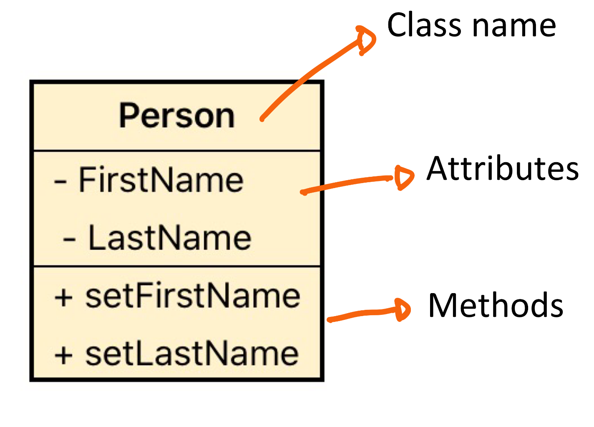

# Introduction to Object Oriented Programming

### Definition

#### Described in Wikipedia as: 

Object-oriented programming (OOP) is a programming paradigm based on the concept of 
"objects", which can contain data and code: data in the form of fields (often known as 
attributes or properties), and code, in the form of procedures (often known as methods).

#### Let’s break these three lines down:

We create computer software in order to solve different problems that we 
find in real life, there are many different approaches to do so, 
and modeling our solution based on OOP is one of them.  
There are other paradigms such as Procedural, Functional, Logical etc. that could also provide good solutions to the 
same problem fixed using OOP.

Our 3 lines definition mentioned the following concepts:

**Methods**
- Methods are associated to the behaviour, what can our objects do.

**Attributes**
- Is data that belongs to individual objects, every object has its own copy of each one.

### Let's make a example

#### Say Hello

    I’m tired to say hello all the time, so I’ll make a solution using OOP to solve that problem.

Based on my three lines definition from Wikipedia, it seems that I’ll need an object that says hello, but how do I create 
one?

The answer to that question is **classes**: They will hold all the definition (attributes and methods) that your objects 
will have when instantiated.

**So what is an object?** Is an instance of a class. 

Back to the Hello example, I need to create a class that will allow every instance to say hello. 

```php
class Mariano {
	public function sayHello() {
		return 'hello';
    }
}
```

In order to run an instance of Mariano, we have to:
```php
	$mariano = new Mariano();
	echo $mariano->sayHello();
```
(Check Lesson2Ex1.php file)

1. The class created here is Mariano.
2. The instance of the class is the object, the variable $mariano.
3. The class Mariano has behaviour, it “knows” how to say Hello.

**Some things about the sintax**

* All classes names start with uppercase.
* Method names start with lowercase.

#### Adding attributes

Let's imagine that the piece of code that we created is super cool, and my friend Matu wants to be use it to say 
give greetings.

As object oriented programming is about to model real world scenarios, 

It wouldn't be cool that he needs to create a Mariano instance to say hello, if we think about this class and it’s 
behaviour, a good name would be Greeter. So, lets change it.

```php
class Greeter {

	public function sayHello() {
		return 'hello';
        }
}
```
In order to create an instance of Greeter, we have to change our code to:

```php
$greeter = new Greeter();
echo $greeter->sayHello();
```

My friend and I can have two objects that say hello for us.

```php
$mariano = new Greeter();
$matu = new Greeter();
echo $mariano->sayHello();
echo $mariano->sayHello();
```

The problem with this code, is that none can make a difference between me and my friend Matu saying hello, 
so a good improvement would be that our program can say “hello, my name is {name}”
 
In order to do so, we are going to introduce the following concepts:

2. Attributes: 
- Are the “fields” that will hold the data for each instance of the class.
- The list of attributes will be defined after the class declaration.

1. Constructor: 
- A constructor a method executed when creating an object. It's to initialize a object of a certain class.
- Constructors can receive a list of parameters with the purpose of ensuring that the object will contain all the 
necessary initial values for creating the object.
- In PHP a constructor is defined as __construct() 

```php
Class Greeter {

	private $name;

	public function __construct(string $name) {
		$this->name = $name;
	}

	public function sayHello() {
		return  'hello, my name is' . $this->name . '\n';
    }
}
```

We will have to change the rest of our code in order for it to work.
```php
$mariano = new Greeter('Mariano');
echo $mariano->sayHello();
$matu = new Greeter('Matu');
echo $matu->sayHello();
```

Some interesting thing happened with the last change :

- We added a constructor, and defined that a name is necessary for instantiating a new object.
- We have two different objects instantiated, that are of the same type. But they have different values in their attributes.

### Class Diagram

Class diagram will allow us to model classes that currently exist in the code, or ones that we want to create. 
Here is a example about how to represent a class in UML.

<div>

</div>

### Homework

Please answer the questions for the files:

Before continue take a look at [Abstract class example](./Practice/AbstractClass1.php)
 - [Lesson2Ex1.php](./Practice/Exercise1.php) 
 - [Lesson2Ex2.php](./Practice/Exercise2.php)  
 - [Lesson2Ex3.php](./Practice/Exercise3.php)

After answering each question, commit them in your fork for this project. We'll revisit them in the following class.
