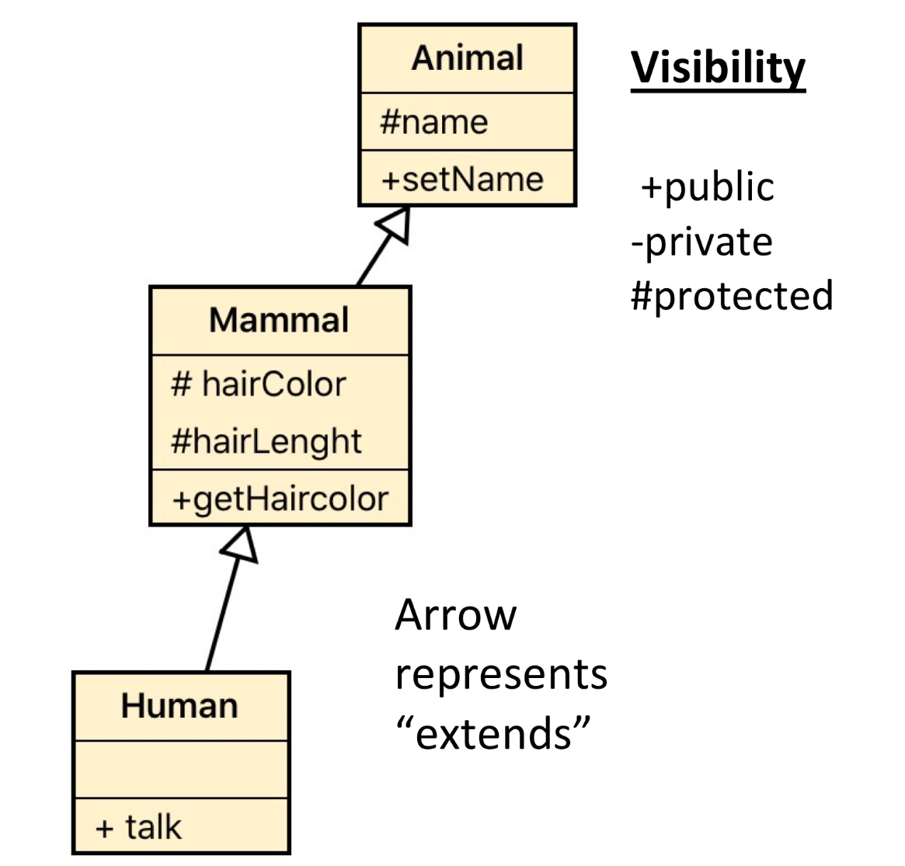

# Inheritance

## Introduction

Inheritance is one of the most important concepts in OOP, It allows developers to provide more powerful designs when 
modeling a solution.

Inheritance allows objects to inherit attributes and behaviour from their parents. In the real world there are a lot of 
examples that will help us to think about inheritance. 

Related to attributes:
- "You have your father's smile"
- "You have your mother's hair"

Related to behavior:
- You play football as well as your dad.
- Your are as smart as your mom.

Despite the examples, in the real world we find these kinds of references that are related to our parents, something that
we inherit from them despite we are different persons.
If we think about inheritance a little more, we find that we can find lots of common behaviour in the nature.

We are humans -> humans are mammals -> mammals are animals.

if we think about the behaviour:

- Animals have a name. (attribute)
- Mammals have hair (attribute)
- Humans can talk. (behaviour)

If we think about the this simple representantion of the real world in OOP we can end up with something
like this :

```php
class Animal {
    
    protected $name;
    
    public function getName() {
        return $this->name;
    }
    
    public function setName(string $name) {
        $this->name = $name;
    }

}

class Mammal extends Animal {
    
    protected $hairColor;
    protected $hairLenght;
    
    public function getHairColor() {
        return $this->hairColor;
    }

    public function getHairLenght() {
        return $this->hairLenght;
    }

    public function setHairColor(string $color) {
        $this->hairColor = $color;
    }

    public function setHairLenght(string $length) {
        $this->hairLenght = $length;
    }
}

class Human extends Mammal {

    public function talk() {
        echo 'Hi Im talking';
    }

}
```
One important keyword appeared in the example above: **extends** . 

The extends keyword is used to indicate that our classes are actually, a sub-class. When creating a subclass, it will
have access to the behaviour and methods of its super class.

```php
    // New Human
    $mariano = new Human();
    // As mariano extends Mammal, public methods from Animal are inherited.
    $mariano->setHairColor('Brown');
    $mariano->setHairLenght('Short');
    // As mariano is a Human that extends Mammal which extends Animal, mariano has access to Animal mehtods and attributes.
    $mariano->setName("Mariano - Human");
    // From animal
    echo $mariano->getName() . "\n";
    // From Mammal
    echo $mariano->getHairColor() . "\n";
    echo $mariano->getHairLenght() . "\n";
    // Finaly the human class
    echo $mariano->talk() . "\n";
```
You can find the code in /Practice/InheritanceExample1.php

### Private and Protected methods and attributes.

If you read carefully the example above, you may have noticed that all attributes in the example have the **Protected** 
keyword.

#### Why?

When dealing with inheritance, we have access to 1 more access modifier from the one's that we already know. 
 
**protected**: By setting a method or attribute as protected, you grant access to it to all the subclasses, but 
protecting them from the outside world. 

**public** access modifier remains the same as we learned in the previous lesson.

**private** access modifier grants access to attribute and methods only to the class that is declaring them. 
 
Let's code a example in order to explore this concept.

We can refactor our Human Class in order to take advantage from the protected attributes and methods:

```php

class Human extends Mammal {

    // Usage of protected attributes
    public function talk() {
        echo "Hi, I am {$this->name}, and my hair is {$this->hairColor} and {$this->hairLenght} and I am talking";
    }

}

// New Human
$mariano = new Human();
// As mariano extends Mammal, public methods from Animal are inherited.
$mariano->setHairColor('Brown');
$mariano->setHairLenght('Short');
// As mariano is a Human that extends Mammal which extends Animal, mariano has access to Animal mehtods and attributes.
$mariano->setName("Mariano - Human");
$mariano->talk();
echo "\n";
```
 You can find the code in /Practice/InheritanceExample2.php

### Override methods
One of the most powerful tools that inheritance provides is the capability of overriding the protected and public methods
of the super classes. Some classes, can actually do the same that their super class but in a different way.

```php
class Square {

    private $side;

    function __construct(int $side)
    {
        $this->side = $side;
    }

    public function getArea() {
        return pow($this->side, 2);
    }
}

class Cube extends Square {

    /*
     * Cube overrides getArea from square.
     * Cube has access to parent::getArea() which is, in this case Square::getArea()
     * Cube will modify the result and return its own area.
     */
    public function getArea()
    {
        $squareArea = parent::getArea();
        return 6 * $squareArea;
    }

}

$cube = new Cube(2);
echo $cube->getArea() ."\n";
```

### Class diagram

As now some classes are extending others we have to connect them somehow in our class diagram. This is done by adding an arrow pointing the super class. 

Another thing to keep in mind is to be aware the visibility of the methods and attributes.

<div>

</div>


 You can find the code in /Practice/InheritanceExample3.php

>Notice: Square defines a constructor, but Cube doesn't. 
>when creating a Cube, it's constructor (empty) and parent::__construct will be executed. 
