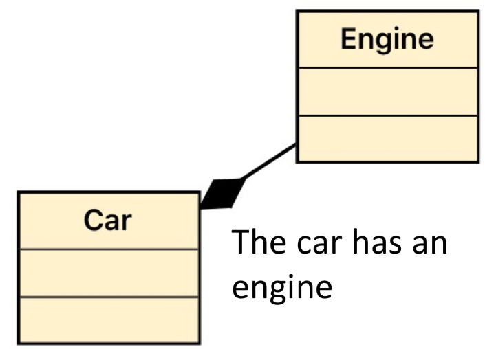
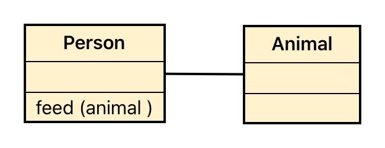
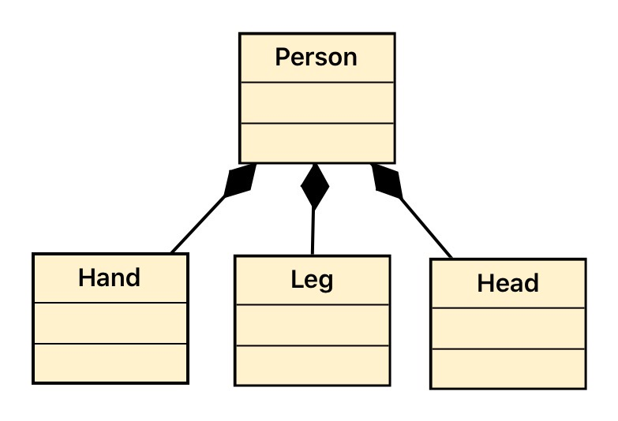
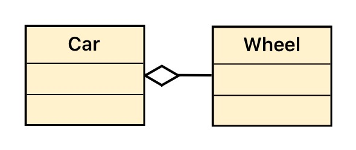

# Composition

Composition is one of the fundamental concepts in object-oriented programming. It is a way to combine objects or data types into more complex ones.
The most common way to materialize composition is by desigining a class that will have other objects as attributes.

You can find composition with real world examples, a car for example has  4 wheels, an engine, a number of seats etc. Each
of these components have a specific purpose and a function.

## Car Example

```php
class Engine {

    private $hp;
    private $manufacturer;
    private $serialNumber;
    private $fuelType;

    public function start()
    {
      echo "Engine Started\n";   
    }
    
    public function stop()
    {
      echo "Engine Stopped\n";       
    }

}

class Car {
    
    private $engine;
    
    public function __construct(Engine $engine) {
        $this->engine = $engine;
    }
    
    public function ride()  {
          // some code
          $this->engine->start();
           // Continues code of ride   
    }
    
    public function endRide() 
    {
        // some code
        $this->engine->stop();
        // some code
    }

}
```

## Composition vs Inheritance

Inheritance was another way to reuse behaviour, but what is the difference with composition?
The key to that answer is to think about the difference between "is" and "has".

1. A Car has an Engine. (Composition)
2. A Human is a Mammal, and a Mammal is an Animal. (Inheritance)


## Class diagram 

<div>

</div>


### Association, Composition and Agreggation

#### Association: 

When modeling a solution, if two classes needs to communicate with eachother, a link between those two classes should be represented.

<div>

</div>


A person feeds an animal. 
In this case, the way to represent agregation is with a line.


#### Composition 
Composition implies that that the weakest object cannot "live" in our model if the class that owns it does not exist. Think in this particular schemario.

<div>

</div>

In this case, a person can still live without a hand. But there wont be any reason for hand to exist if it does not belong to a person. 

The correct way of represeting this kind of link is with a black diamond.


#### Agregation

Agregation differs from composition in one way: The object has a meaning in the model if it's not part of other.

<div>

</div>

The correct way of represeting this kind of link is with a white diamond.
