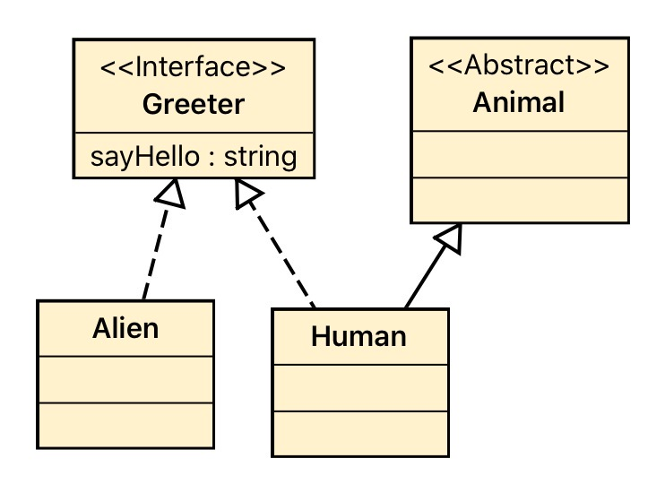

# Interfaces

Interfaces allow us to specify the behavior that must be implemented by classes. Think about interfaces as a contract
that needs to be honored if you want to implement it.

Interfaces allows you to work fully abstracted from the implementations.

### Declaring interfaces
```php
interface Greeter {
    public function sayHello() : string;
}
```
### Implementing interfaces

```php
class Human implements Greeter {
 
    public function sayHello() : string {
        echo "hello";
    }    
}
```

You might be thinking: _'Hey, this is pretty much the same as abstract methods'_. Well, yes if thinking about that you need 
somehow to implement that behaviour and no, if you think about the nature of interfaces. 

When working with interfaces you have to think the following:

_I don't care who you actually are, or where do you come from as long as you can do what I need_

Interfaces will allow you to model behaviour without the need of inheritance, objects from different class families can have the same behaviour and type hinted as implementors of the interface. 


```php
interface Greeter{
    public function sayHello() : string;
}

abstract class Animal {
}

class Human extends Animal implements Greeter {

    public function sayHello() : string {
        return "hello";
    }
}

class Alien implements Greeter
{
    public function sayHello() : string {
        return "Term tonk'peh";
    }
}

$human = new Human();
$alien = new Alien();

greet($human);
greet($alien);

function greet(Greeter $greeter)
{
    echo $greeter->sayHello() . "\n";
}
```

### UML Class Diagram

<div>

</div>


### Real world example

Let's suppose that you have to log what's happening in your code and your company decided to have two different loggers

1. A logger that will write an output in the console if you are in a development environment.
2. A logger that will write the output to a file if you are in production mode.


```php

interface LoggerInterface {
    public function logAction(string $action);
}

class CliLogger implements LoggerInterface {

    public function logAction(string $action)
    {
        echo $action . "\n";
    }
}

class FileLogger implements LoggerInterface {

    private $fileLocation;

    public function __construct(string $fileLocation)
    {
        $this->fileLocation = $fileLocation;
    }

    public function logAction(string $action)
    {
        /*
         * Open the file actionLog and add a new line with the log. 
         */
        file_put_contents($this->fileLocation, $action . PHP_EOL ,FILE_APPEND);
    }
}

class Greeter {
    private $logger;

    public function __construct(LoggerInterface $logger)
    {
        $this->logger = $logger;
    }

    public function giveGreetings()
    {
        $this->logger->logAction("I'm about to give greetings");
        echo "Hello world\n";
        $this->logger->logAction("I've just gave greetings");
    }

}


$greeter = new Greeter(new CliLogger());
$greeter->giveGreetings();

$greeter = new Greeter(new FileLogger(__DIR__ . "/actionLog.log"));
$greeter->giveGreetings();
```
